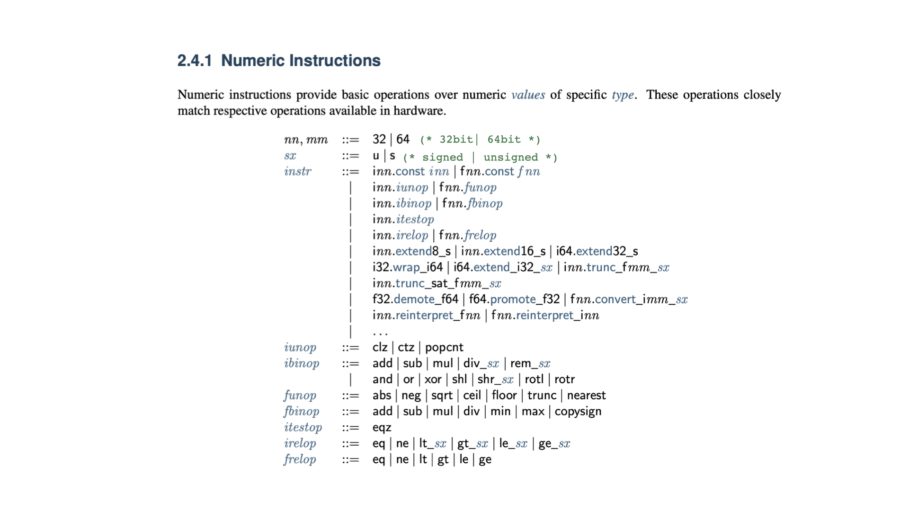

# instruction & semantic of inst
{: .align-center}
<!--  -->
## numeric instruction
```
nn,mm : # of bits
sx : unsigned / signed
iunop : operand having one integer type var
ibinop : operand having two integer type var
irelop / frelop : logic operand having integer/float type var
```


