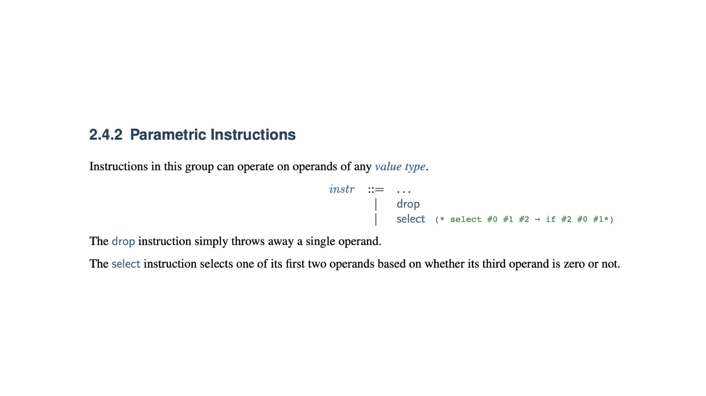
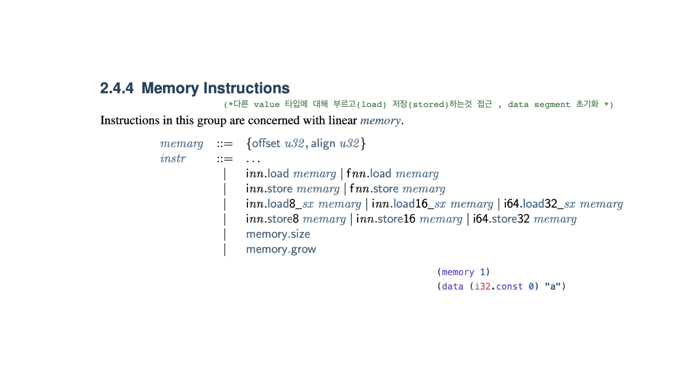
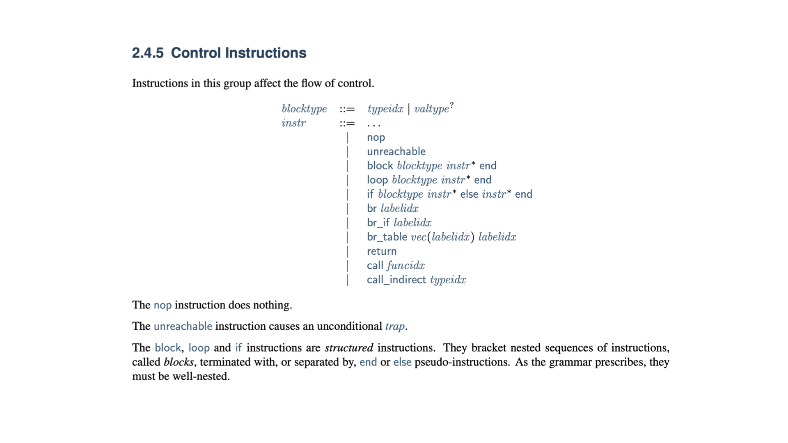
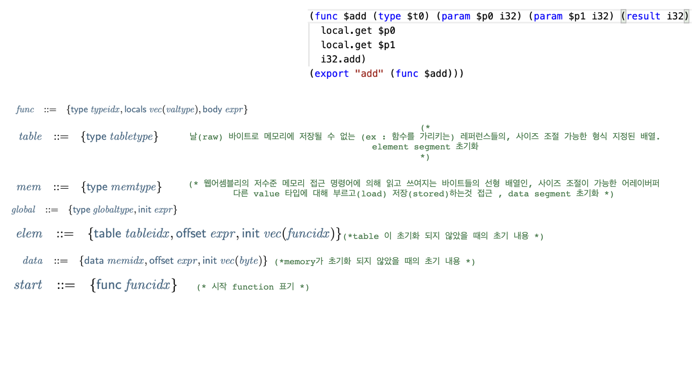
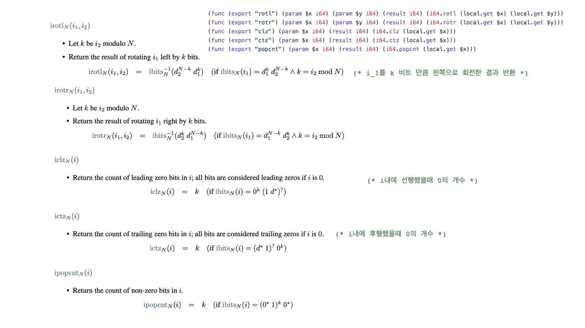
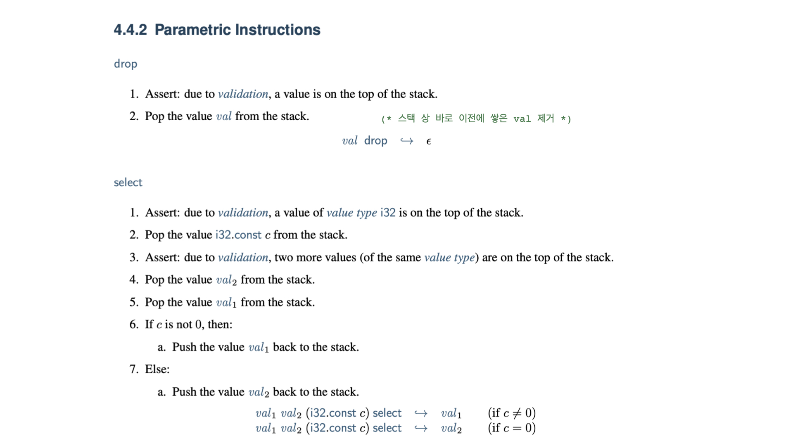
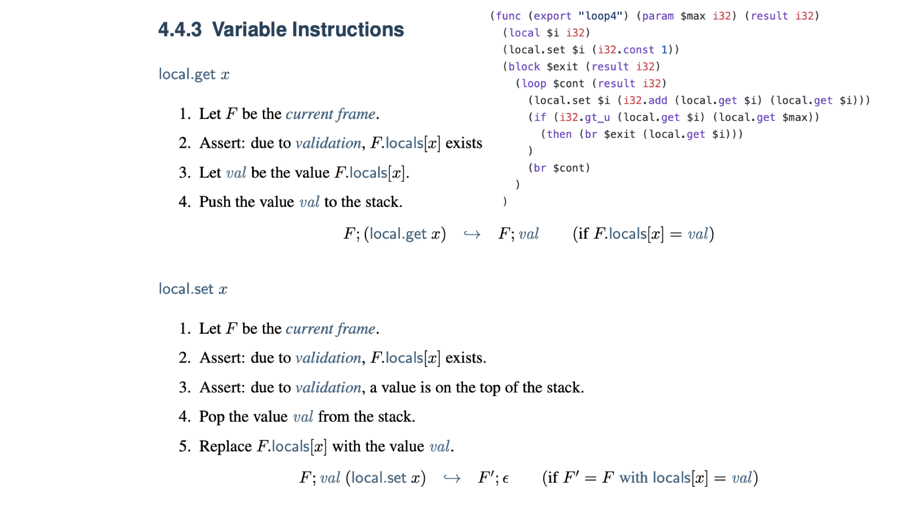
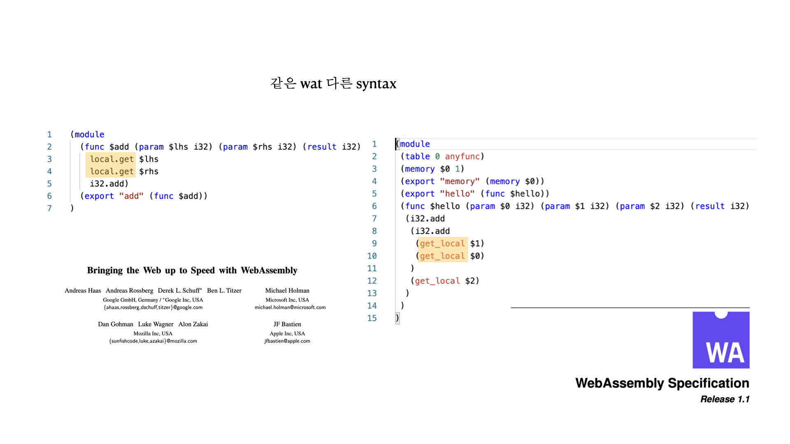

# instruction & semantic of inst

## numeric instruction
```
nn,mm : # of bits
sx : unsigned / signed
iunop : operand having one integer type var
ibinop : operand having two integer type var
irelop / frelop : logic operand having integer/float type var
```

drop : pop post of stack




br : break










newly version have local.get

It can be prefix or postfix.